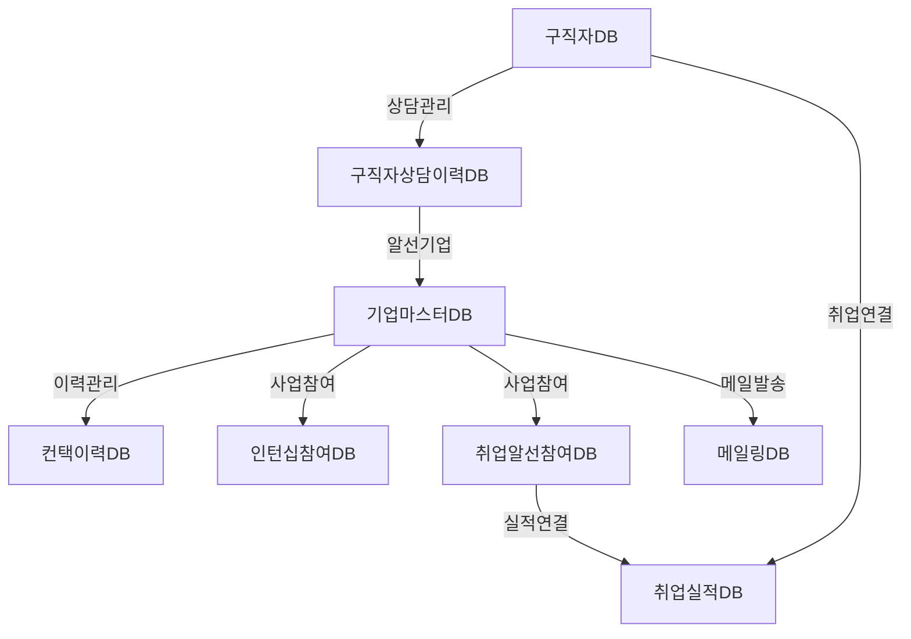
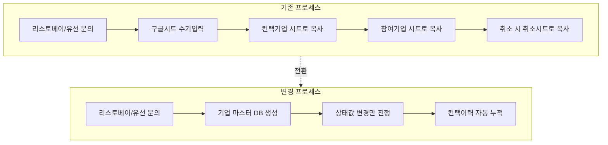
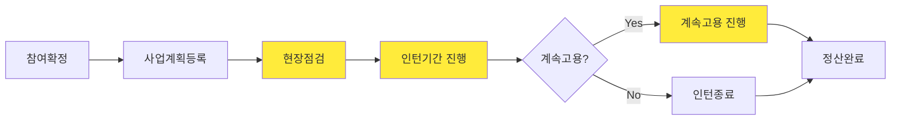
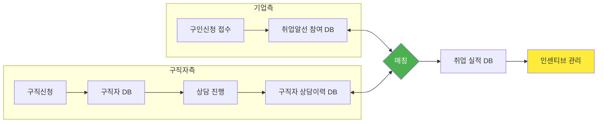
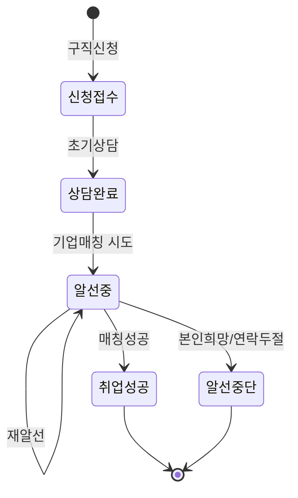
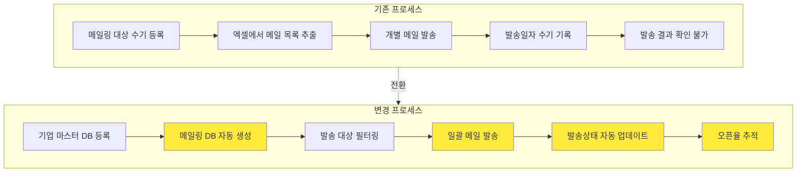
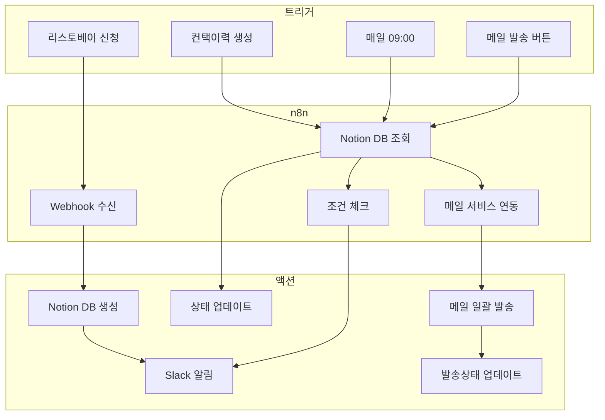
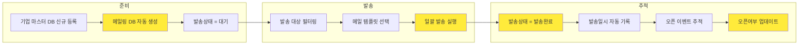

# 시니어 취업지원사업 Notion DB 설계 및 업무 프로세스

> **문서 목적** : Notion DB 전환에 따른 업무 프로세스 변경사항 공유 및 검토

---

## 1. 현황 및 문제점

### 1.1 현재 데이터 관리 현황 (총 13개 시트)

| 구분 | 시트 수 | 시트명 |
|------|--------|--------|
| 기업 관리 | 8개 | (통합)기업관리DB, (통합)컨택기업DB, (인턴십)참여기업DB, (취알)참여기업DB, 취업알선_컨택기업DB, 취소기업, (TM)취업알선(기업), 취업알선_구인신청 |
| 구직자 관리 | 2개 | (취알)구직접수대장(구직자), (취알)실적등록 |
| 사업 관리 | 1개 | (인턴십)사업 관리 |
| 메일링 | 2개 | 메일링(1,526건), (메일링)강서구일자리센터 |

### 1.2 주요 Pain Point (PDF 업무기술서 기반)

```
❌ 기록이 여러 사람에 의해 흩어져 관리됨
❌ 담당자 변동 시 인수인계 누락 발생
❌ 전체 히스토리 파악 어려움
❌ 기업별 데이터 누적/조회 비효율
❌ 리스토베이 신청 즉시 확인 어려움
❌ 메일링 대상 수기 관리 및 발송 이력 추적 어려움
```

---

## 2. Notion DB 구조 설계

### 2.1 DB 구성도



### 2.2 DB 목록 및 용도

| # | DB명 | 용도 | 기존 시트 대체 |
|---|------|------|---------------|
| 1 | 기업 마스터 DB | 전체 기업 통합 관리 | (통합)기업관리DB, 컨택기업DB, 취소기업 |
| 2 | 컨택 이력 DB | 기업 상담/상태변경 이력 | 시트 내 통화기록 컬럼 |
| 3 | 인턴십 참여 DB | 인턴십 사업 세부 관리 | (인턴십)참여기업DB, 사업관리 |
| 4 | 취업알선 참여 DB | 취업알선 사업 세부 관리 | (취알)참여기업DB, 구인신청 |
| 5 | 구직자 DB | 구직 신청자 관리 | (취알)구직접수대장 |
| 6 | 구직자 상담이력 DB | 구직자 상담/알선 이력 | 알선사항기록 컬럼 |
| 7 | 취업 실적 DB | 취업 매칭 결과 | (취알)실적등록 |
| **8** | **메일링 DB** | **메일 발송 대상/이력 관리** | **메일링, (메일링)강서구일자리센터** |

---

## 3. 상세 스키마

### 3.1 기업 마스터 DB

| 컬럼명 | 타입 | 설명 | 기존 대응 |
|--------|------|------|----------|
| 기업명 | Title | - | 사업체명 |
| 상태 | Select | 9단계 상태값 | 시트 분리로 관리 |
| 접수일자 | Date | - | 접수일자 |
| 접수경로 | Select | 리스토베이/유선/TM/이메일/기타 | 접수경로 |
| 담당자 | People | 내부 담당자 | 상담자 |
| 사업자번호 | Text | - | 사업자번호 |
| 주소 | Text | - | 주소 |
| 지역 | Select | 강남구/서초구/강서구/마포구 등 | 지역 |
| 기업담당자명 | Text | - | 담당자 |
| 기업담당자연락처 | Phone | - | 담당자 직통번호 |
| 기업담당자이메일 | Email | - | 이메일 |
| 상시근로자수 | Number | - | 상시근로자수 |
| 채용직무 | Text | - | 채용직무/모집직종 |
| 참여사업 | Multi-select | 인턴십/취업알선 | 취알/인턴십 체크 |
| 서류제출현황 | Multi-select | 5종 서류 | 개별 컬럼 |
| 특이사항 | Text | - | 특이사항 |
| 컨택이력 | Relation | → 컨택이력 DB | - |
| 메일링이력 | Relation | → 메일링 DB | - |

**상태값 정의:**

```
문의접수 → 1차컨택 → 참여검토중 → 인턴십_참여확정
                              → 취업알선_참여확정
                              → 참여취소
         
참여확정 → 사업진행중 → 계약완료 → 사업종료
```

### 3.2 컨택 이력 DB

| 컬럼명 | 타입 | 설명 |
|--------|------|------|
| 제목 | Title | 자동: 기업명+날짜 |
| 기업 | Relation | → 기업 마스터 DB |
| 컨택유형 | Select | 유선통화/메일발송/방문/기타 |
| 컨택일시 | Date | - |
| 담당자 | People | - |
| 상태변경 | Select | 변경된 상태값 |
| 내용 | Text | 상담 메모, 소통 내용 |
| 메일발송여부 | Checkbox | - |

### 3.3 인턴십 참여 DB

| 컬럼명 | 타입 | 설명 |
|--------|------|------|
| 기업명 | Title | - |
| 기업 | Relation | → 기업 마스터 DB |
| 참여자명 | Text | - |
| 참여자연락처 | Phone | - |
| 사업실행계획등록일 | Date | - |
| 현장점검 | Checkbox | - |
| 4대보험 | Checkbox | - |
| 참여시작일 | Date | - |
| 참여종료일 | Date | - |
| 인턴지원금신청완료 | Checkbox | - |
| 계속고용여부 | Select | Y/N/검토중 |
| 계속고용시작일 | Date | - |
| 계속고용종료일 | Date | - |
| 채용지원금신청완료 | Checkbox | - |
| 퇴사일 | Date | - |
| 퇴직사유 | Text | - |
| 정산상태 | Select | 미정산/1차정산/완료 |

### 3.4 취업알선 참여 DB

| 컬럼명 | 타입 | 설명 |
|--------|------|------|
| 기업명 | Title | - |
| 기업 | Relation | → 기업 마스터 DB |
| 구인신청일 | Date | - |
| 채용직무 | Text | - |
| 채용인원 | Number | - |
| 채용성별 | Select | 무관/남/여 |
| 자격및경력 | Text | - |
| 고용형태 | Select | 정규직/계약직/일용직 |
| 요청사항 | Text | - |
| 매칭완료 | Rollup | 취업실적 카운트 |

### 3.5 구직자 DB

| 컬럼명 | 타입 | 설명 |
|--------|------|------|
| 이름 | Title | - |
| 접수일자 | Date | - |
| 접수창구 | Select | 방문/유선/온라인 |
| 연락처 | Phone | - |
| 생년월일 | Date | - |
| 성별 | Select | 남/여 |
| 주소 | Text | - |
| 희망근무지역 | Text | - |
| 희망직종 | Text | - |
| 상태 | Select | 신청접수/상담완료/알선중/취업성공/알선중단 |
| 서류제출 | Multi-select | 신청서/확약서/교육관리대장 |
| 특이사항 | Text | - |
| 담당자 | People | - |

### 3.6 구직자 상담이력 DB

| 컬럼명 | 타입 | 설명 |
|--------|------|------|
| 제목 | Title | 자동: 구직자명+날짜 |
| 구직자 | Relation | → 구직자 DB |
| 상담일시 | Date | - |
| 상담유형 | Select | 유선/방문/이메일/기타 |
| 담당자 | People | - |
| 상태변경 | Select | 변경된 상태값 |
| 상담내용 | Text | - |
| 알선기업 | Relation | → 기업 마스터 DB |
| 알선결과 | Select | 매칭성공/거절/보류/미응답 |

### 3.7 취업 실적 DB

| 컬럼명 | 타입 | 설명 |
|--------|------|------|
| 제목 | Title | 자동: 구직자명+기업명 |
| 기업 | Relation | → 취업알선 참여 DB |
| 구직자 | Relation | → 구직자 DB |
| 취업일자 | Date | - |
| 퇴사일자 | Date | - |
| 취업개월수 | Formula | 자동 계산 |
| 인센티브지급 | Checkbox | - |
| 담당자 | People | - |
| 비고 | Text | - |

### 3.8 메일링 DB ⭐ 신규

| 컬럼명 | 타입 | 설명 | 기존 대응 |
|--------|------|------|----------|
| 제목 | Title | 자동: 기업명+발송일 | - |
| 기업 | Relation | → 기업 마스터 DB | 회사 |
| 기입일자 | Date | 명단 등록일 | 기입일자 |
| 지역 | Select | 강남구/서초구/강서구 등 | 지역 |
| 채용직무 | Text | - | 직무 |
| 이메일 | Email | 발송 대상 이메일 | 메일 |
| 대상사업 | Multi-select | 시니어인턴/시니어취업알선 | 시니어인턴, 시니어취업알선 |
| 발송상태 | Select | 대기/발송완료/발송실패/수신거부 | - |
| 발송일시 | Date | 실제 메일 발송일 | 메일발송일 |
| 발송출처 | Select | 본사/강서구일자리센터/기타 | 시트 구분 |
| 오픈여부 | Checkbox | 메일 오픈 추적 (자동화 시) | - |
| 비고 | Text | - | 비고 |

---

## 4. 업무 프로세스 변경

### 4.1 기업 관리 프로세스



| 단계 | 기존 방식 | 변경 방식 | 자동화 가능 |
|------|----------|----------|:-----------:|
| 문의 접수 | 구글시트에 수기 입력 | 기업 마스터 DB에 신규 생성 | 🤖 |
| 1차 컨택 | 통화 후 시트에 메모 | 컨택이력 DB에 기록 생성 | 🤖 |
| 안내 메일 발송 | 발송 후 날짜 수기 입력 | 컨택이력에서 체크 | 🤖 |
| 참여 검토 | 컨택기업DB 시트로 복사 | 상태="참여검토중" 변경 | - |
| 참여 확정 | 참여기업DB 시트로 복사 | 상태 변경 + 사업 DB 생성 | 🤖 |
| 참여 취소 | 취소기업 시트로 복사 | 상태="참여취소" 변경 | 🤖 |

### 4.2 인턴십 사업 관리 프로세스



> 🤖 노란색 단계: 기한 리마인더 자동화 가능

| 단계 | 기존 방식 | 변경 방식 | 자동화 가능 |
|------|----------|----------|:-----------:|
| 사업계획 등록 | 시트에 수기 입력 | 인턴십 참여 DB에 날짜 입력 | - |
| 현장점검 | 체크 표시 | 체크박스 ✓ | 🤖 D-7 알림 |
| 인턴 기간 관리 | 시작일/종료일 수기 관리 | Date 필드 자동 계산 | 🤖 종료 D-30 알림 |
| 지원금 정산 | 별도 관리 | 정산상태 Select 추적 | 🤖 기한 알림 |
| 퇴사 처리 | 사유 수기 기록 | 퇴사일/퇴직사유 기록 | - |

### 4.3 취업알선 사업 관리 프로세스



| 단계 | 기존 방식 | 변경 방식 | 자동화 가능 |
|------|----------|----------|:-----------:|
| 구인 신청 접수 | 구인신청 시트에 입력 | 취업알선 참여 DB에 기록 | 🤖 |
| 구직자 매칭 | 별도 시트 확인 후 수기 연결 | 상담이력에서 알선기업 연결 | - |
| 취업 성공 | 실적등록 시트에 별도 입력 | 취업 실적 DB 생성 | 🤖 상태 자동변경 |
| 인센티브 관리 | 개월수 수기 계산 | Formula 자동 계산 | 🤖 3개월 알림 |

### 4.4 구직자 관리 프로세스



| 단계 | 기존 방식 | 변경 방식 | 자동화 가능 |
|------|----------|----------|:-----------:|
| 구직 신청 | 시트에 수기 입력 | 구직자 DB 신규 생성 | 🤖 온라인 신청 시 |
| 상담 진행 | "알선사항기록" 컬럼에 텍스트 누적 | 구직자 상담이력 DB에 건별 기록 | - |
| 기업 알선 | 텍스트로 기업명 기록 | 상담이력에서 기업 Relation 연결 | - |
| 알선 결과 | 텍스트로 결과 기록 | 알선결과 Select 선택 | - |
| 상태 변경 | 수기로 상태 판단 | 상담이력 생성 시 상태 연동 | 🤖 |

### 4.5 메일링 프로세스 ⭐ 신규



| 단계 | 기존 방식 | 변경 방식 | 자동화 가능 |
|------|----------|----------|:-----------:|
| 대상 등록 | 메일링 시트에 수기 입력 | 기업 등록 시 메일링 DB 자동 생성 | 🤖 |
| 발송 대상 선정 | 엑셀 필터링 후 복사 | Notion 뷰 필터 (지역/사업/발송상태) | - |
| 메일 발송 | 개별 발송 또는 수동 일괄 | n8n 연동 일괄 발송 | 🤖 |
| 발송 기록 | 발송일 수기 입력 | 발송상태/일시 자동 업데이트 | 🤖 |
| 결과 추적 | 추적 불가 | 오픈여부 자동 기록 | 🤖 |
| 통계 확인 | 지역별 수동 집계 | 대시보드 실시간 집계 | 🤖 |

---

## 5. 뷰(View) 활용 가이드

### 5.1 기존 시트 → Notion 뷰 매핑

기존 시트 분리 대신 **하나의 DB + 필터링된 뷰**로 동일 효과 구현

| 기존 시트 | Notion 뷰 | 필터 조건 |
|----------|-----------|-----------|
| (통합)기업관리DB | 📋 전체 기업 | 필터 없음 |
| (통합)컨택기업DB | 📞 컨택 진행중 | 상태 = 1차컨택, 참여검토중 |
| (인턴십)참여기업DB | 🏢 인턴십 참여 | 참여사업 contains 인턴십 |
| (취알)참여기업DB | 💼 취업알선 참여 | 참여사업 contains 취업알선 |
| 취소기업 | ❌ 참여 취소 | 상태 = 참여취소 |
| 메일링 | 📧 메일링 전체 | 필터 없음 |
| (메일링)강서구일자리센터 | 📧 강서구 메일링 | 발송출처 = 강서구일자리센터 |
| - | 👤 내 담당 기업 | 담당자 = @me |
| - | ⚠️ 메일 미발송 | 상태=1차컨택 AND 메일발송=false |

### 5.2 메일링 DB 추천 뷰

| 뷰 이름 | 필터 조건 | 용도 |
|---------|-----------|------|
| 📧 발송 대기 | 발송상태 = 대기 | 발송 예정 대상 확인 |
| ✅ 발송 완료 | 발송상태 = 발송완료 | 발송 이력 확인 |
| 🏷️ 지역별 현황 | Group by 지역 | 지역별 통계 |
| 📊 사업별 현황 | Group by 대상사업 | 인턴십/취알 구분 |
| 📅 이번 주 발송 | 발송일시 = This week | 최근 발송 내역 |

### 5.3 추천 대시보드 뷰

```
📊 시니어사업 대시보드
├── 📈 이번 주 신규 문의 (Gallery)
├── 📞 오늘 컨택 예정 (Table)
├── ⏰ 기한 임박 (Calendar)
│   ├── 현장점검 D-7
│   ├── 인턴종료 D-30
│   └── 인센티브 지급 예정
├── 📋 상태별 현황 (Board - Kanban)
├── 👥 담당자별 업무량 (Table - Group by)
└── 📧 메일링 현황 (Table)
    ├── 지역별 발송 통계
    ├── 이번 주 발송 건수
    └── 오픈율 현황
```

---

## 6. 자동화 시나리오 (n8n 연동)

### 6.1 구현 가능한 자동화 목록

| # | 자동화 항목 | 트리거 | 액션 | 우선순위 |
|---|------------|--------|------|:--------:|
| 1 | 리스토베이 신청 알림 | 신규 신청 접수 | Slack 알림 + DB 자동 생성 | ⭐⭐⭐ |
| 2 | 상태 변경 연동 | 컨택이력 생성 | 기업 상태 자동 업데이트 | ⭐⭐⭐ |
| **3** | **메일링 일괄 발송** | **수동 트리거 / 스케줄** | **발송대기 → 메일 발송 → 상태 업데이트** | **⭐⭐⭐** |
| **4** | **메일링 DB 자동 생성** | **기업 마스터 DB 생성** | **메일링 DB 레코드 자동 생성** | **⭐⭐⭐** |
| 5 | 메일 발송 이력 | Gmail 발송 | 컨택이력 자동 생성 | ⭐⭐ |
| 6 | 현장점검 리마인더 | 점검일 D-7 | Slack 알림 | ⭐⭐ |
| 7 | 인턴종료 알림 | 종료일 D-30 | 계속고용 확인 알림 | ⭐⭐ |
| 8 | 인센티브 알림 | 취업 3개월 도래 | 담당자 Slack 알림 | ⭐⭐ |
| **9** | **메일 오픈 추적** | **메일 오픈 이벤트** | **메일링 DB 오픈여부 업데이트** | **⭐⭐** |
| 10 | 메일 미발송 체크 | 1차컨택 후 24시간 | 미발송 시 알림 | ⭐ |
| 11 | 담당자 변경 알림 | 담당자 필드 변경 | 인수인계 알림 | ⭐ |

### 6.2 자동화 흐름도 예시



### 6.3 메일링 자동화 상세 흐름



---

## 7. 변경사항 요약

### 7.1 없어지는 것 ✅

- [ ] 시트 간 데이터 복사/붙여넣기
- [ ] 동일 기업 정보 중복 입력
- [ ] "이 기업 이전에 연락한 적 있나?" 히스토리 찾기
- [ ] 담당자 변경 시 인수인계 문서 별도 작성
- [ ] 취업 개월수 수동 계산
- [ ] **메일링 대상 수동 추출/관리**
- [ ] **메일 발송 후 수기 기록**
- [ ] **지역별 메일링 통계 수동 집계**

### 7.2 새로 해야 하는 것 📝

- [ ] 컨택 시 **컨택이력 DB**에 기록 생성 (기존 메모 입력 대신)
- [ ] 상태 변경 시 **Select 값** 변경 (시트 이동 대신)
- [ ] 구직자 상담 시 **상담이력 DB**에 건별 기록
- [ ] **메일 발송 시 메일링 DB에서 대상 선택** (엑셀 추출 대신)

### 7.3 개선되는 것 🚀

| 항목 | 기존 | 개선 |
|------|------|------|
| 기업 히스토리 조회 | 여러 시트 검색 | 한 페이지에서 전체 이력 확인 |
| 담당자 인수인계 | 문서 작성 필요 | 담당자 변경만으로 자동 완료 |
| 기한 관리 | 수동 확인 | 자동 리마인더 |
| 현황 파악 | 시트별 수동 집계 | 대시보드 실시간 확인 |
| 중복 입력 | 시트마다 입력 | 1회 입력 후 연결 |
| **메일링 관리** | **수동 추출/발송/기록** | **자동 생성/발송/추적** |
| **메일링 통계** | **지역별 수동 집계** | **대시보드 실시간 확인** |
| **발송 결과** | **확인 불가** | **오픈율 자동 추적** |

---

## 8. 검토 요청 사항

다음 사항에 대해 검토 및 피드백 부탁드립니다:

### 8.1 DB 구조 관련

- [ ] 각 DB의 컬럼 구성이 실제 업무에 적합한가요?
- [ ] 추가/삭제가 필요한 컬럼이 있나요?
- [ ] 상태값 정의가 현재 업무 흐름을 반영하나요?
- [ ] **메일링 DB의 지역 구분이 적절한가요?**
- [ ] **메일링 대상사업 구분(인턴/취알)이 적절한가요?**

### 8.2 업무 프로세스 관련

- [ ] 변경된 프로세스에 누락된 단계가 있나요?
- [ ] 자동화 우선순위가 적절한가요?
- [ ] 추가로 자동화가 필요한 업무가 있나요?
- [ ] **메일링 발송 주기는 어떻게 되나요? (주1회/월1회/수시)**
- [ ] **메일 템플릿이 사업별로 다른가요?**

### 8.3 데이터 마이그레이션 관련

- [ ] 기존 엑셀 데이터 중 이관이 필요한 범위는?
- [ ] 이관 시 데이터 정제가 필요한 부분은?
- [ ] **기존 메일링 시트(1,526건) 전체 이관 필요한가요?**

---

## 9. 다음 단계

1. **검토 완료 후**: Notion DB 생성 (8개 DB)
2. **DB 생성 후**: 샘플 데이터 입력 및 테스트
3. **테스트 완료 후**: 기존 데이터 마이그레이션
4. **안정화 후**: n8n 자동화 구축
   - 1단계: 리스토베이 연동 + 상태 변경 자동화
   - 2단계: 메일링 자동화
   - 3단계: 리마인더/알림 자동화

---

> 📌 **문의사항**: 해당 문서에 대한 질문이나 수정 요청은 담당자에게 연락 바랍니다.
